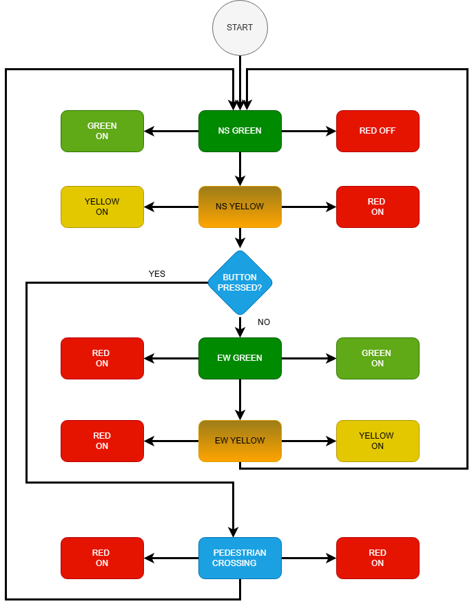

## Initial implementation
of traffic light FSM using millis() and Tinkercad simulation.

## Improved Version
- Fixed improper ISR usage (removed millis from ISR).
- Implemented safe debouncing in main loop.
- Improved system reliability and structure.

## FSM Diagram

